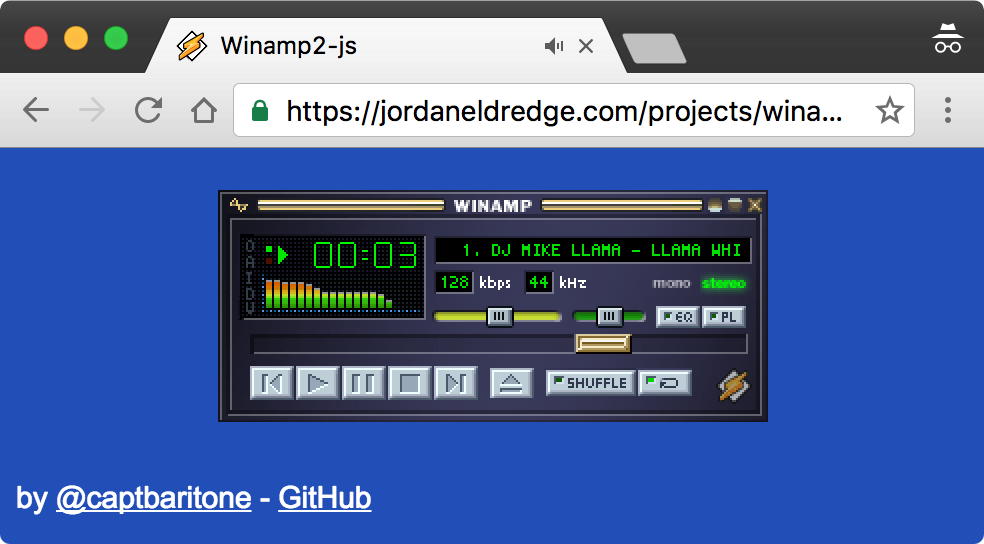

[]() []() [](https://gitter.im/winamp2-js/Lobby?utm_source=badge&utm_medium=badge&utm_campaign=pr-badge&utm_content=badge)

# Winamp2-js

A reimplementation of Winamp 2.9 in HTML5 and JavaScript.

**As seen on [TechCrunch], [Motherboard], [Gizmodo], Hacker News ([1], [2], [3]), and [elsewhere](./press.md).**

## [Give it a try!](https://jordaneldredge.com/projects/winamp2-js/)

[](https://jordaneldredge.com/projects/winamp2-js/)

Works in modern versions of Edge, Firefox, Safari and Chrome. IE is [not
supported](http://caniuse.com/#feat=audio-api).

## Features

Check out this Twitter thread for an illustrated list of features: https://twitter.com/captbaritone/status/961274714013319168

## Use Winamp2-js in your project **PRE ALPHA**

There are many websites that could potentially benefit from having Winamp embeded in them. That said, nobody that I know of is really doing this in production. In an attempt to try this out, I have published Winamp2-js as an NPM package. The API is far from stable as I don't actually know all the various use-cases it should support. Some potential ones are:

* A player that can load files from Dropbox using the [Dropbox JavaScript SDK](http://dropbox.github.io/dropbox-sdk-js/).
* A player that comes preloaded with a SoundCloud playlist.
* A player that's compatible with [https://github.com/justinfrankel/WHUMP] database files.
* A player that can be used to demonstrate skins on a skins website.
* A generic podcast widget.
* Something else?

You can attempt to use it in your JS project like so:

Install the package:

```
npm install --save winamp2-js
```

Create a DOM element somewhere in your HTML document:

```
<div id='winamp2-js'></div>
```

Initialize Winamp2-js in your JavaScript:

```JavaScript
import Winamp from 'winamp2-js';

const winamp = new Winamp({
  initialTracks: [{
    metaData: {
      artist: "DJ Mike Llama",
      title: "Llama Whippin' Intro",
    },
    url: "https://d38dnrh1liu4f5.cloudfront.net/projects/winamp2-js/mp3/llama-2.91.mp3"
  }],
  initialSkin: {
    url: "https://d38dnrh1liu4f5.cloudfront.net/projects/winamp2-js/skins/base-2.91.wsz"
  },
  enableHotkeys: true // Enable hotkeys
});
// Render after the skin has loaded.
winamp.renderWhenReady(document.getElementById('winamp2-js'));
```

_Notes:_

* This should not be considered "production" code.
  * Winamp2-js does not support Internet Explorer.
  * Winamp2-js was built to run on its own page, it may not play well with surrounding CSS.
* Skin and audio URLs are subject to [CORS](https://developer.mozilla.org/en-US/docs/Web/HTTP/Access_control_CORS). Please ensure they are either served from the same domain, or that the other domain is served with the correct headers.
* This API is subject to change at any time.
* Please reach out to me. I'd love to help you set it up, and understand how it's being used. I plan to expand this API as I learn how people want to use it.

## Development

    yarn
    # Or: npm install
    npm start

Open `http://localhost:8080/webpack-dev-server/` in your browser.

## Building

    npm install
    npm run build
    npm run serve

Open the local ip/port that is output to the console in your browser.

## Deploying

These commands assume you have an SSH key to my server, which you probably
don't have. Feel free to adapt them to your own server.

    npm run deploy

### Reverting

    npm run revert # Reverts quickly to the previous deploy
    HASH=<SOME_GIT_HASH> npm run deploy # Runs a new deploy at a given hashlike.

### Advanced Usage

There are some "feature flags" which you can manipulate by passing a specially crafted URL hash. Simply supply a JSON blob after the `#` of the URL to change these settings:

* `skinUrl` (string) Url of the default skin to use. Note, this file must be served with the correct Allows Origin header.
* `audioUrl` (string) Url of the default audio file to use. Note, this file must be served with the correct Allows Origin header.
* `hideAbout` (boolean) Selectively hide the byline and GitHub link at the bottom of the page. Useful for taking screenshots.
* `initialState` (object) Override the [initial Redux state](js/reducers.js). Values from this object will be recursively merged into the actual default state.

**Note:** These are intended mostly as development tools and are subject to change at any time.

## Reference

* [skinspecs.pdf](http://members.xoom.it/skinart/tutorial/skinspecs..pdf)
* [Skinner's Atlas 1.5 by Jellby](http://forums.winamp.com/showthread.php?p=951257)
* [Winamp Skinning Tutorial](http://people.xmms2.org/~tru/promoe/Winamp_skinning_tutorial_1_5_0.pdf)
* Sacrat Skinning tutorial parts [1](http://www.hugi.scene.org/online/hugi26/hugi%2026%20-%20graphics%20skinning%20sacrat%20winamp%20skinning%20tutorial%20-%201.htm), [2](http://www.hugi.scene.org/online/hugi26/hugi%2026%20-%20graphics%20skinning%20sacrat%20winamp%20skinning%20tutorial%20-%202.htm), [3](http://www.hugi.scene.org/online/hugi26/hugi%2026%20-%20graphics%20skinning%20sacrat%20winamp%20skinning%20tutorial%20-%203.htm), [4](http://www.hugi.scene.org/online/hugi26/hugi%2026%20-%20graphics%20skinning%20sacrat%20winamp%20skinning%20tutorial%20-%204.htm), and [5](http://www.hugi.scene.org/online/hugi26/hugi%2026%20-%20graphics%20skinning%20sacrat%20winamp%20skinning%20tutorial%20-%205.htm),
* [Winamp Wiki](http://wiki.winamp.com/wiki/Creating_Classic_Skins)

## Predecessors

* [Webamp2x](http://forums.winamp.com/showthread.php?threadid=91850) An
  impressive implementation from 2002(!).

* [JsAmp](http://freecog.net/2005/jsamp/demo/MainWindow.xhtml) An implementation from 2005 by @twm (via [Hacker News](https://news.ycombinator.com/item?id=15317723)).

* [LlamaCloud Comp](https://vimeo.com/20149683) From 2011 by [Lee Martin](http://www.leemartin.com/) (via [Twitter](https://twitter.com/leemartin/status/910235793737814017))

* [Winamp em HTML5 e Javascript](http://www.tidbits.com.br/winamp-em-html5-e-javascript)
  In 2010 a developer named Danilo posted one of his HTML5 experiments: "an
  audio player simulating good old Winamp". You will have to download the zip
  file.

* [JuicyDrop](http://cggaurav.github.io/juicydrop/) An HTML5 implementation with
  less emphasis on being true to the skin, but fully featured visualizations.
  @cggaurav is keeping it alive on [GitHub](https://github.com/cggaurav/juicydrop)

* [Spotiamp](http://spotiamp.com/) The folks at Spotify reimplemented Winamp as
  a frontend for Spotify. Not in a browser, and only runs on Windows.

## Thanks

* Research and feature prototyping: @PAEz
* Beta feedback, catching many small UI inconsistencies: [LuigiHann](https://twitter.com/LuigiHann)
* Beta feedback and insider answers to obscure Winamp questions: [Darren Owen](https://twitter.com/The_DoctorO)

Thank you to [Justin Frankel](http://www.1014.org/) and everyone at Nullsoft
for Winamp which inspired so many of us.

## License

While the Winamp name, interface, and, sample audio file are surely property of
Nullsoft, the code within this project is released under the [MIT
License](LICENSE.txt). That being said, if you do anything interesting with
this code, please let me know. I'd love to see it.

[TechCrunch]: https://techcrunch.com/2018/02/09/whip-the-llamas-ass-with-this-javascript-winamp-emulator/
[Motherboard]: https://motherboard.vice.com/en_us/article/qvebbv/winamp-2-mp3-music-player-emulator
[Gizmodo]: https://gizmodo.com/winamp-2-has-been-immortalized-in-html5-for-your-pleasu-1655373653
[1]: https://news.ycombinator.com/item?id=8565665
[2]: https://news.ycombinator.com/item?id=15314629
[3]: https://news.ycombinator.com/item?id=16333550
