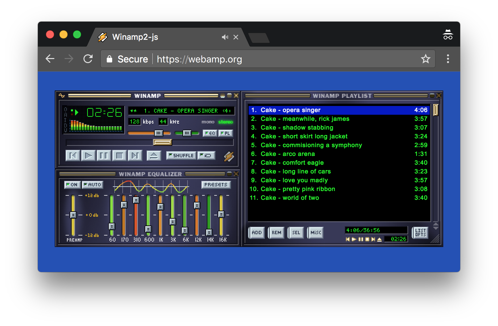

  

# Winamp2-js

A reimplementation of Winamp 2.9 in HTML5 and JavaScript.

**As seen on [TechCrunch], [Motherboard], [Gizmodo], Hacker News ([1], [2], [3]), and [elsewhere](./docs/press.md).**

## [Give it a try!](https://webamp.org)

Works in modern versions of Edge, Firefox, Safari and Chrome. IE is [not
supported](http://caniuse.com/#feat=audio-api).

## Features

Check out this Twitter thread for an illustrated list of features: https://twitter.com/captbaritone/status/961274714013319168

## Use Winamp2-js in your own project

I've tried to make it possible to include Winamp2-js in your own project.

See the [usage documentation](./docs/usage.md) for more information.

## Development

    yarn
    # Or: npm install
    npm start

Open `http://localhost:8080/webpack-dev-server/` in your browser.

    # Run tests and lint checks
    npm test

## Building

    npm install
    npm run build
    npm run serve

Open the local ip/port that is output to the console in your browser.

## Deploying

[Travis](https://travis-ci.org/) runs the build and then pushes the contents of `./built` to the `gh-pages` branch of this repository. GitHub Pages then serve that directory as <https://webamp.org>. CloudFlare sits in front of GitHub pages to provide the SSL certificate.

In short, deploying should be as simple as pushing a commit to master which builds, lints and passes all tests.

### Advanced Usage

There are some "feature flags" which you can manipulate by passing a specially crafted URL hash. Simply supply a JSON blob after the `#` of the URL to change these settings:

* `skinUrl` (string) Url of the default skin to use. Note, this file must be served with the correct Allows Origin header.
* `audioUrl` (string) Url of the default audio file to use. Note, this file must be served with the correct Allows Origin header.
* `hideAbout` (boolean) Selectively hide the byline and GitHub link at the bottom of the page. Useful for taking screenshots.
* `initialState` (object) Override the [initial Redux state](js/reducers.js). Values from this object will be recursively merged into the actual default state.

**Note:** These are intended mostly as development tools and are subject to change at any time.

## Reference

* [skinspecs.pdf](http://members.xoom.it/skinart/tutorial/skinspecs..pdf)
* [Skinner's Atlas 1.5 by Jellby](http://forums.winamp.com/showthread.php?p=951257)
* [Winamp Skinning Tutorial](http://people.xmms2.org/~tru/promoe/Winamp_skinning_tutorial_1_5_0.pdf)
* Sacrat Skinning tutorial parts [1](http://www.hugi.scene.org/online/hugi26/hugi%2026%20-%20graphics%20skinning%20sacrat%20winamp%20skinning%20tutorial%20-%201.htm), [2](http://www.hugi.scene.org/online/hugi26/hugi%2026%20-%20graphics%20skinning%20sacrat%20winamp%20skinning%20tutorial%20-%202.htm), [3](http://www.hugi.scene.org/online/hugi26/hugi%2026%20-%20graphics%20skinning%20sacrat%20winamp%20skinning%20tutorial%20-%203.htm), [4](http://www.hugi.scene.org/online/hugi26/hugi%2026%20-%20graphics%20skinning%20sacrat%20winamp%20skinning%20tutorial%20-%204.htm), and [5](http://www.hugi.scene.org/online/hugi26/hugi%2026%20-%20graphics%20skinning%20sacrat%20winamp%20skinning%20tutorial%20-%205.htm),
* [Winamp Wiki](http://wiki.winamp.com/wiki/Creating_Classic_Skins)

## Predecessors

* [Webamp2x](http://forums.winamp.com/showthread.php?threadid=91850) An
  impressive implementation from 2002(!).

* [JsAmp](http://freecog.net/2005/jsamp/demo/MainWindow.xhtml) An implementation from 2005 by @twm (via [Hacker News](https://news.ycombinator.com/item?id=15317723)).

* [LlamaCloud Comp](https://vimeo.com/20149683) From 2011 by [Lee Martin](http://www.leemartin.com/) (via [Twitter](https://twitter.com/leemartin/status/910235793737814017))

* [Winamp em HTML5 e Javascript](http://www.tidbits.com.br/winamp-em-html5-e-javascript)
  In 2010 a developer named Danilo posted one of his HTML5 experiments: "an
  audio player simulating good old Winamp". You will have to download the zip
  file.

* [JuicyDrop](http://cggaurav.github.io/juicydrop/) An HTML5 implementation with
  less emphasis on being true to the skin, but fully featured visualizations.
  @cggaurav is keeping it alive on [GitHub](https://github.com/cggaurav/juicydrop)

* [Spotiamp](http://spotiamp.com/) The folks at Spotify reimplemented Winamp as
  a frontend for Spotify. Not in a browser, and only runs on Windows.

## Thanks

* Research and feature prototyping: @PAEz
* Beta feedback, catching many small UI inconsistencies: [LuigiHann](https://twitter.com/LuigiHann)
* Beta feedback and insider answers to obscure Winamp questions: [Darren Owen](https://twitter.com/The_DoctorO)

Thank you to [Justin Frankel](http://www.1014.org/) and everyone at Nullsoft
for Winamp which inspired so many of us.

## License

While the Winamp name, interface, and, sample audio file are surely property of
Nullsoft, the code within this project is released under the [MIT
License](LICENSE.txt). That being said, if you do anything interesting with
this code, please let me know. I'd love to see it.

[techcrunch]: https://techcrunch.com/2018/02/09/whip-the-llamas-ass-with-this-javascript-winamp-emulator/
[motherboard]: https://motherboard.vice.com/en_us/article/qvebbv/winamp-2-mp3-music-player-emulator
[gizmodo]: https://gizmodo.com/winamp-2-has-been-immortalized-in-html5-for-your-pleasu-1655373653
[1]: https://news.ycombinator.com/item?id=8565665
[2]: https://news.ycombinator.com/item?id=15314629
[3]: https://news.ycombinator.com/item?id=16333550
