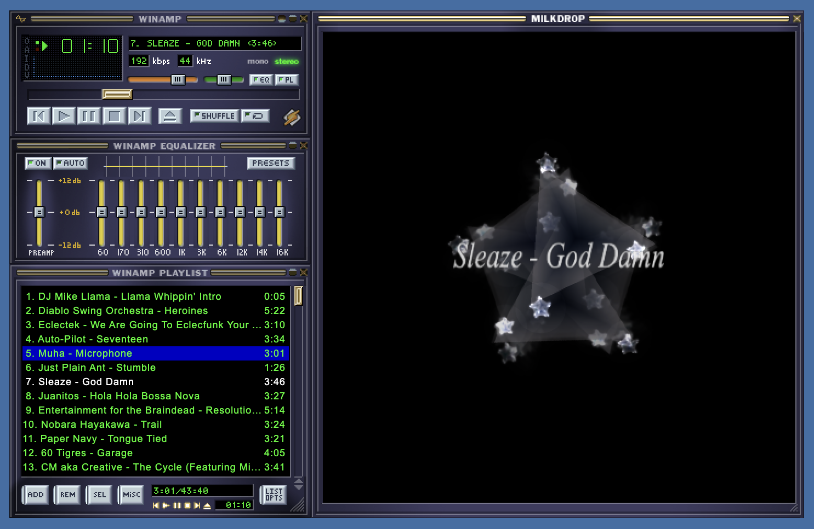
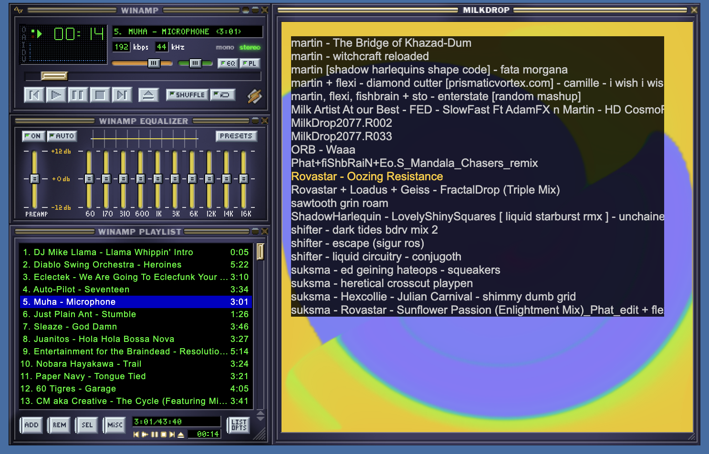
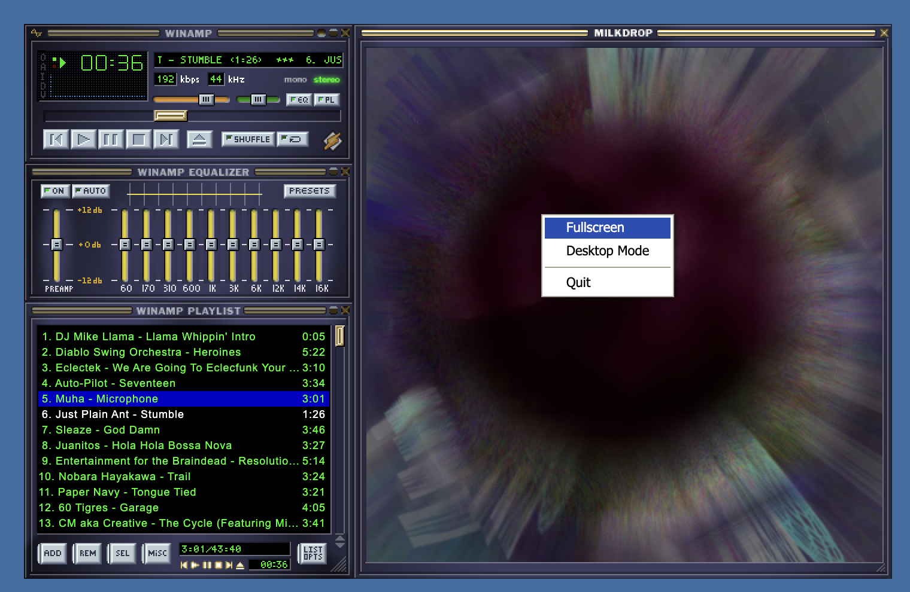
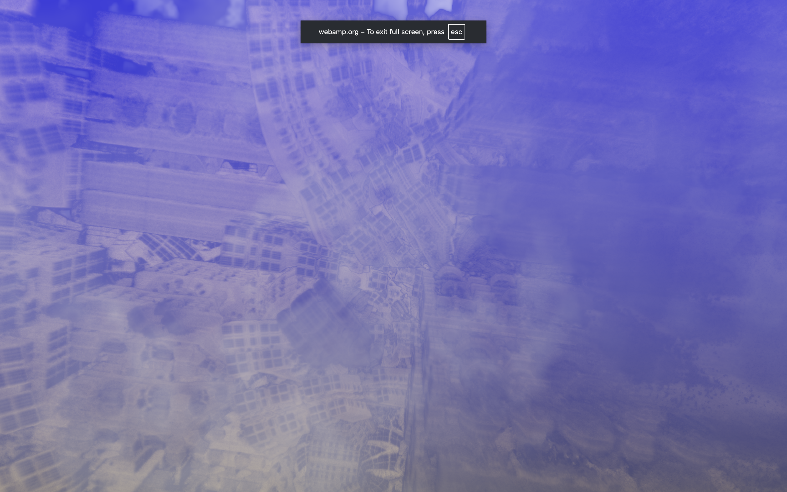

# Milkdrop

Webamp uses [Butterchurn](https://butterchurnviz.com/) to provide a Milkdrop visualizer. Butterchurn is a JavaScript port of the original Milkdrop visualizer, and it can run in any modern web browser.

Starting with [v2.2.0](../12_changelog.md#220) Webamp includes a `webamp/butterchurn` entrypoint that includes Butterchurn, so you can use it to create a Webamp instance with Milkdrop visualizer enabled. See "Minimal Milkdrop" in [examples](../04_examples.md) for more details.

## Hotkeys

When the Milkdrop window is focused, there are several hotkeys you can use to control the visualizer. The full list can be found on the [Hotkeys](./01_hotkeys.md#milkdrop-hotkeys) page.

## Preset Cycling

By default Webamp will automatically cycle through Milkdrop presets in a random order every 15 seconds. During the transition Butterchurn perform a transition where the image from the previous preset is used as input into the next preset, creating a smooth transition effect.

See [Hotkeys](./01_hotkeys.md#milkdrop-hotkeys) for the hotkeys to control preset cycling.

## Track Title

When the track changes, the Milkdrop visualizer will show the current track title and incorporate it into the visualizer. You can trigger this manually by focusing the Milkdrop window and pressing `T`. This will display the current track title in the visualizer for a few seconds.

## Preset Selection Menu

With the Milkdrop window open, you can press upper or lower case `L` to open the preset selection menu. From there you can use arrow key to navigate through the presets, and press `Enter` to select one. After selection Webamp will start gradually transitioning to the new preset. You can press `Esc` to close the menu.

## Modes

Webamp supports two immersive modes for Milkdrop: "Full Screen" and "Desktop". You can select these modes by right-clicking on the Milkdrop window and selecting "Full Screen" or "Desktop" from the context menu.

### Desktop Mode

In "Desktop" mode, Milkdrop visualization will take over the full window's background. You can right click on the background to exit this mode.

### Full Screen Mode

In "Full Screen" mode, Milkdrop will take over the entire screen, hiding all other content. You can exit this mode by pressing `Esc`.

