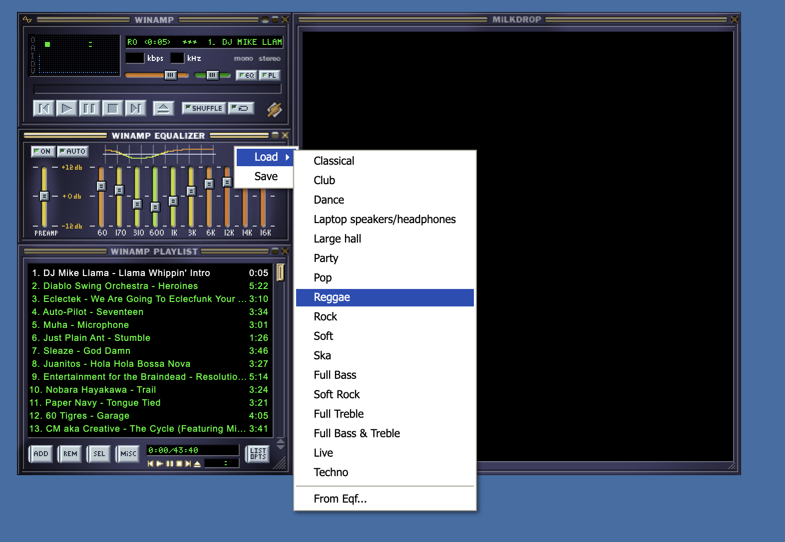

# Equalizer

Webamp emulates the Winamp equalizer including the skin-defined slider animations and splined EQ graph whose colors are defined by the skin.

:::tip
Just like in Winamp, you can click the "+12db", "+0db", "-12db" labels it will create a flat line EQ at that level.
:::

## Presets

The Webamp equalizer includes Winamp's built-in presets. It also supports Winamp's custom `.eqf` preset file format. This means you can configure the equalizer to create a preset and then save it to a file, which can be loaded later either in Webamp or Winamp. You can also drag a `.eqf` file saved from Winamp onto the Webamp window to load it.

