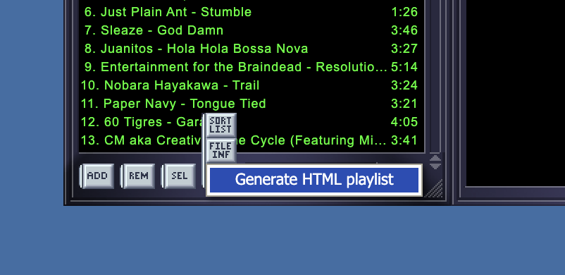
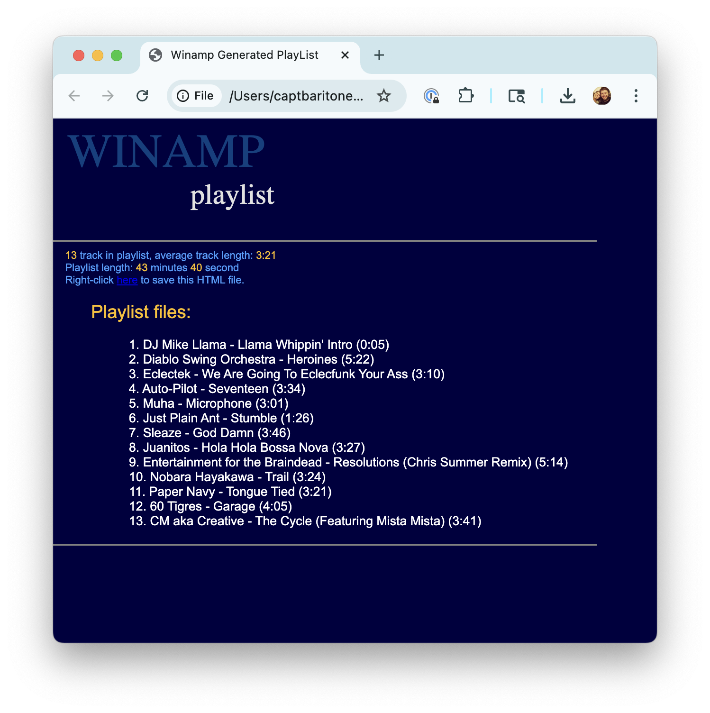
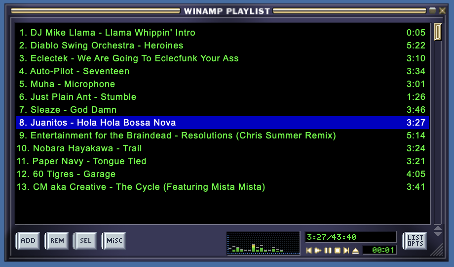

# Playlist

## Generate HTML Playlist

Webamp implements's Winamp feature for exporting the current playlist to an HTML file. This feature is available in the Webamp UI under the "Playlist" menu, and it allows you to generate a simple HTML file that lists all the tracks in the current playlist in exactly the same style as Winamp's HTML.

The resulting HTML file looks like this:

## Mini Visualizer

If the main and Milkdrop windows are both hidden (via the context menu) and the playlist is horizontally expanded, Webamp will display a mini visualizer in the playlist window. If the main widow is visible, the mini visualizer will not be active.

